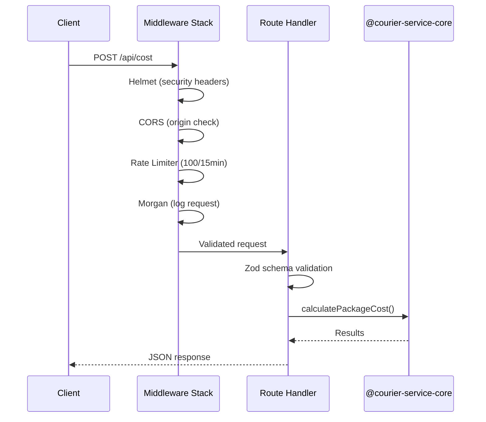

# @nurulizyansyaza/courier-service-api

Express REST API for the **Courier Service** App Calculator. Wraps the core library with HTTP endpoints, security middleware, input validation, and rate limiting.

## Setup

```bash
npm install
npm run build   # compile TypeScript to dist/
```

Requires [`courier-service-core`](https://github.com/nurulizyansyaza/courier-service-core) to be built and available as a sibling directory (linked via `file:../courier-service-core`).

## Usage

```bash
# Development (ts-node)
npm run dev

# Production
npm start       # runs dist/index.js
```

Server starts on `http://localhost:3000` (override with `PORT` env variable).

## API Endpoints

### `GET /api/health`

Health check. Returns `{ "status": "ok" }`.

### `POST /api/cost`

Calculate delivery cost with offer discounts.

```json
// Request
{ "input": "100 3\nPKG1 5 5 OFR001\nPKG2 15 5 OFR002\nPKG3 10 100 OFR003" }

// Response
{ "results": [{ "id": "PKG1", "discount": 0, "cost": 175 }, ...] }
```

### `POST /api/delivery`

Calculate delivery time estimation.

```json
// Request
{ "input": "100 5\nPKG1 50 30 OFR001\n...\n2 70 200" }

// Response
{ "results": [{ "id": "PKG1", "discount": 0, "cost": 750, "time": 4.00, ... }] }
```

Always returns detailed results with vehicle assignment information.

### `POST /api/delivery/transit`

Calculate delivery time with transit package tracking.

```json
// Request
{ "input": "...", "transitPackages": [{ "id": "T1", "weight": 10, "distance": 20, "offerCode": "X" }] }
```

## Request Flow



## Security Middleware

All requests pass through:

| Middleware | Purpose |
|-----------|---------|
| **Helmet** | Security headers (X-Content-Type-Options, X-Frame-Options, etc.) |
| **CORS** | Restricts origins to `localhost:5173`, `localhost:3000`, and `CLOUDFRONT_DOMAIN` env var |
| **Rate Limiter** | Global: 100 requests / 15 min. Calculation endpoints: 30 requests / min |
| **Morgan** | HTTP request logging |
| **Body Limit** | JSON body capped at 10kb |
| **Zod Validation** | Schema-based input validation on all POST endpoints |

## Testing

```bash
npm test
```

- **Unit tests** — mocked core library, tests route logic and validation
- **Integration tests** — real core library, end-to-end calculations via supertest

## CI/CD

GitHub Actions workflow (`.github/workflows/ci.yml`) runs on push/PR to `main`:

1. **Test** — checks out `courier-service-core`, builds it, then runs API tests on Node 18 + 20
2. **Trigger Staging Deploy** — on push to `main`, triggers a staging deploy on [`courier-service`](https://github.com/nurulizyansyaza/courier-service), which triggers the staging deployment pipeline

Requires a `DEPLOY_TRIGGER_TOKEN` secret (fine-grained PAT with Actions + Contents write access on the `courier-service` repo).

## API Testing with Bruno

A [Bruno](https://www.usebruno.com/) collection is included in `bruno/` for manual and interactive API testing.

### Setup

1. **Install Bruno** — download from [usebruno.com](https://www.usebruno.com/downloads) or `brew install bruno`
2. **Open the collection** — in Bruno, click **Open Collection** and select the `bruno/` folder inside this repository
3. **Select an environment** — click the environment dropdown (top right) and choose:

| Environment | Base URL | Use case |
|-------------|----------|----------|
| **Local** | `http://localhost:3000` | Local development (`npm run dev`) |
| **Staging** | `https://d28gbmf77bx81u.cloudfront.net` | Staging (CloudFront → API Gateway → ECS) |
| **Production** | `https://d31r5a2wvtwynh.cloudfront.net` | Production (CloudFront → API Gateway → ECS) |

> Staging and Production environments also include an `apiGatewayUrl` variable for testing the API Gateway endpoint directly, bypassing CloudFront.

### Running requests

- **Single request** — click any request and hit **Send** (or <kbd>Ctrl</kbd>+<kbd>Enter</kbd>)
- **Run all** — right-click a folder (e.g. `cost`) and select **Run All Requests** to execute all requests with assertions
- **Switch environment** — change the environment dropdown to test against a different target

### Collection structure

```
bruno/
├── environments/
│   ├── Local.bru               # localhost:3000
│   ├── Staging.bru             # CloudFront staging
│   └── Production.bru          # CloudFront production
├── health/
│   └── Health Check            # GET  /api/health
├── cost/
│   ├── Calculate Cost - Multiple Packages    # POST /api/cost (3 packages)
│   ├── Calculate Cost - Single Package       # POST /api/cost (1 package)
│   ├── Calculate Cost - With Discount        # POST /api/cost (OFR003 verified)
│   ├── Validation - Missing Input            # 400: empty body
│   ├── Validation - Empty Input              # 400: empty string
│   └── Validation - Malformed Input          # 400: unparseable
├── delivery/
│   ├── Calculate Delivery - 5 Packages       # POST /api/delivery (full scenario)
│   ├── Calculate Delivery - Undeliverable    # POST /api/delivery (overweight)
│   └── Validation - Missing Input            # 400: empty body
└── delivery-transit/
    ├── Transit - With Packages               # POST /api/delivery/transit (merge)
    ├── Transit - Conflicting IDs             # POST /api/delivery/transit (rename)
    ├── Transit - No Packages                 # POST /api/delivery/transit (fallback)
    └── Validation - Invalid Transit Packages # 400: bad data
```

Each request includes inline **assertions**, **test scripts**, and **docs** that explain expected behavior and formulas.

## Project Structure

```
src/
  app.ts                  # Express app setup with middleware stack
  index.ts                # Server entry point
  middleware/
    security.ts           # helmet, cors, rate-limit, morgan config
    validation.ts         # Zod schemas + validate() middleware
  routes/
    cost.ts               # POST /api/cost
    delivery.ts           # POST /api/delivery, POST /api/delivery/transit
bruno/                    # Bruno API testing collection (see above)
__tests__/
  routes.unit.test.ts     # Unit tests with mocked core
  api.test.ts             # Integration tests
```
